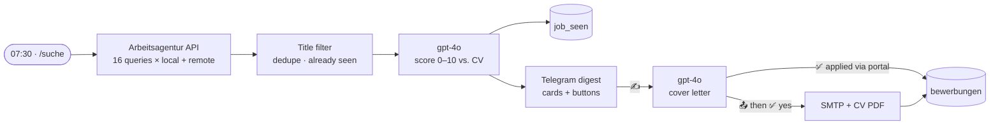

# Job Hunter Bot

A Telegram bot on self-hosted [n8n](https://n8n.io) that runs my own job search: every morning it pulls fresh
openings from the German Federal Employment Agency (Arbeitsagentur), scores each one against my CV with GPT-4o,
writes a tailored German cover letter on request and sends the application — **only after I tap "send" twice**.

Built for my own job search as a career changer (chef → automation). It found the jobs I am applying to now.

**Stack:** n8n (self-hosted, deployed via REST API) · Python (workflow generators) · Arbeitsagentur Jobsuche API ·
OpenAI API (gpt-4o) · Telegram Bot API · SMTP · n8n Data Tables

## What it does

1. **07:30 every day** (or `/suche` in the bot) — 16 keyword queries × two modes: within 40 km of home and ≥80 % remote anywhere in Germany.
2. **Filters** duplicates, jobs already seen and obvious mismatches by title (industrial automation, internships, senior/lead roles).
3. **Scores** every new job 0–10 against a fact sheet of my profile: *"is an application worth it — is there a realistic chance of an interview?"*, plus pros, gaps, remote and English requirements.
4. **Sends a digest** to Telegram: one card per job ≥ 6/10 with buttons, a short "maybe" list for 5/10.
5. **On tap:** ✍️ writes a cover letter for this exact job · 🔄 another version · reply with a wish ("shorter", "more about Python") to rewrite · 📤 send by e-mail with the CV attached (asks for confirmation) · ✅ mark as applied via the company portal · ❌ hide.
6. **Logs every application**; `/bewerbungen` prints the list — handy for the proof of job-search activity the Arbeitsagentur asks for.



Two workflows: **Suche** (search, scoring, digest — 18 nodes) and **Aktionen** (everything the buttons and commands do — 32 nodes).

## Design decisions

- **Human in the loop, on purpose.** Mass auto-applying gets filtered out by German recruiters and is not what I want sent in my name. The bot does the research and the writing; an e-mail leaves only after two explicit taps, and a duplicate-send guard blocks a second e-mail for the same job.
- **No invented facts.** Both the scorer and the letter writer get a fact sheet that also lists what I *don't* have (no CS degree, English A2, no SAP). Letters must use only those facts; placeholders like `[Gehaltsvorstellung ergänzen]` are left for me when the ad asks for things the profile can't answer.
- **Workflows are generated, not clicked together.** `build_workflow.py` and `build_actions.py` emit n8n JSON with stable node UUIDs and keep all JavaScript next to the Python; `deploy.py` upserts the workflows through the n8n REST API. Editing in the n8n UI would be overwritten by the next deploy.
- **Personal data stays out of git.** Profile, IDs and the webhook path live in `private.py` (ignored). `python3 build_*.py --public` builds the versions in [`workflows/`](workflows) with the placeholders from `private_example.py`. The bot token is injected on the server at deploy time and never touches the repo.

## Things that were not obvious

- **Arbeitsagentur API versions:** search only answers on `pc/v6/jobs`, job details only on `pc/v4/jobdetails/<base64 refnr>` (other versions return 403). The remote filter is `homeoffice=prozentual_80` — it is not in the public OpenAPI spec; I found it in the job portal's frontend bundle.
- **Keyword search is fuzzy.** "Automatisierung" alone returns hundreds of electrician jobs, "Make.com" returns warehouse apprenticeships. The keyword list was chosen by running candidates against the live API and keeping the ones that returned relevant titles.
- **OpenAI rate limit (30k tokens/min on gpt-4o):** the first calibration run lost 40 of 60 scores to 429s. Scoring now runs one request every 6.5 s, and failed scores are not stored, so the job is retried the next day instead of being lost.
- **Stale keep-alive sockets to api.telegram.org inside n8n:** the first Telegram request of each run hung until timeout (measured: 30 000 ms vs. 70 ms for the second one), so messages arrived 20–130 s late. All Bot API calls now send `Connection: close`. The built-in Telegram Trigger still hits it when registering its webhook, so `deploy.py` retries activation.
- **`n8n execute` from the CLI can't use Data Tables** (the module isn't loaded there) — on-demand runs go through a webhook instead.
- **The Send Email node (v2.1) appends "This email was sent automatically with n8n" by default** — switched off explicitly; nobody wants that under a job application.

## Run it yourself

Requirements: self-hosted n8n 2.x with Data Tables, an OpenAI key, a Telegram bot, an SMTP account.

```bash
cp private_example.py private.py        # fill in your profile, IDs, postcode
python3 build_workflow.py && python3 build_actions.py
python3 deploy.py --activate            # expects an ssh host "n8n-server" with n8n on 127.0.0.1:5678
```

Create two n8n Data Tables first — `job_seen` (refnr, title, firma, ort, mode, score, status, url, found_at, fit_ru) and
`bewerbungen` (refnr, title, firma, url, channel, recipient, subject, applied_at) — and put the bot token into
`/root/nikitajobs-bot-token.txt` on the server.

Helpers: `scripts/last_run.py` (per-node item counts of the last execution), `scripts/node_output.py` (node timings and output),
`scripts/fake_update.py` (simulate a button tap against the live webhook).

Running cost: about $1–2 per month in OpenAI calls.
